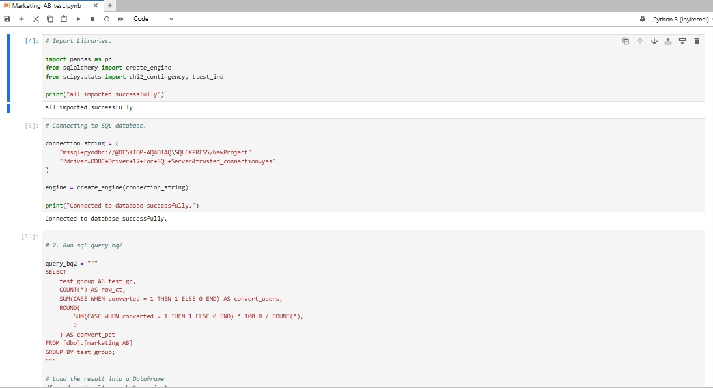
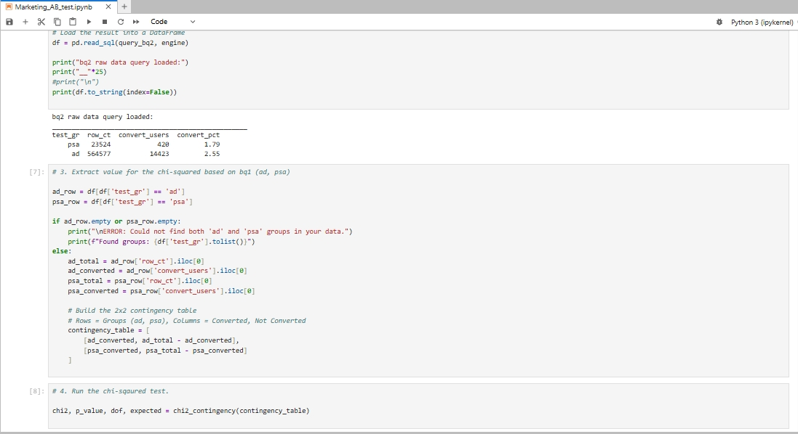
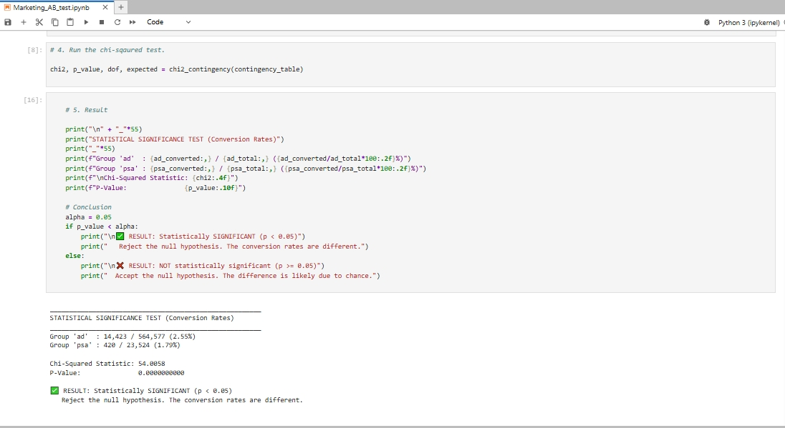

```sql
-- MARKETING A/B TESTING.


/* bq1: Check your group sizes first.

Before any analysis, check how users are split between groups. 
An imbalanced experiment changes how you interpret everything that follows.     */

SELECT COUNT(*) FROM [dbo].[marketing_AB] AS ROW_COUNT; -- dataset row check. 

SELECT [test_group], 
	COUNT(*) AS row_count,
	ROUND(COUNT(*) * 100.0 / SUM(COUNT(*)) OVER(), 2) AS split_pct
  FROM [dbo].[marketing_AB]
  GROUP BY [test_group]             -- group split (1) 'ad' 564577 & split_pct of 96%. (2) 'psa' - 23524 & split_pct of 4%.


/* bq2: Calculates conversion rates by test_group.

The core question: do people who see ads convert at a higher rate? 
Calculate the rate for each group and the relative lift between them.       */

SELECT 
    test_group AS test_gr,
    COUNT(*) AS row_ct,
    SUM(CASE WHEN converted = 1 THEN 1 ELSE 0 END) AS convert_users,
    ROUND(
        SUM(CASE WHEN converted = 1 THEN 1 ELSE 0 END) * 100.0 / COUNT(*), 
        2
    ) AS convert_pct
FROM [dbo].[marketing_AB]
GROUP BY test_group;

/*
-- bq3: Ads exposure. 
Not all users saw the same number of ads. 
Does seeing more ads make you more likely to convert? And if it does — is that causation or correlation?    */

WITH Aggregated AS (
    SELECT 
        test_group,
        AVG(total_ads) AS ads_avg_total,
        MAX(total_ads) AS max_ads,
        MIN(total_ads) AS min_ads
    FROM [dbo].[marketing_AB]
    GROUP BY test_group
),
Median AS (
    SELECT DISTINCT
        test_group,
        PERCENTILE_CONT(0.5) WITHIN GROUP (ORDER BY total_ads) 
            OVER (PARTITION BY test_group) AS med_ads
    FROM [dbo].[marketing_AB]
)
SELECT 
    a.test_group,
    a.ads_avg_total,
    a.max_ads,
    a.min_ads,
    m.med_ads
FROM Aggregated a
INNER JOIN Median m ON a.test_group = m.test_group;
 

WITH ad_seen  AS ( 
    SELECT 
        CASE 
            WHEN [total_ads] BETWEEN 1 AND 20 THEN '1 to 20'
            WHEN [total_ads] BETWEEN 21 AND 50 THEN '21 to 50'
            WHEN [total_ads] BETWEEN 51 AND 100 THEN '51 to 100'
            ELSE '100+' END AS 'Ads_seen',
            converted
    FROM [dbo].[marketing_AB] 
    WHERE [test_group] = 'ad' 
    )   SELECT Ads_seen,
            COUNT(*) AS 'Users',
            ROUND(SUM(CASE WHEN [converted] = 1 THEN 1 ELSE 0 END) * 100.0 / COUNT(*), 2) AS 'conv_rate_pct'
        FROM ad_seen
        GROUP BY Ads_seen

/* bq 4:    

Which day of the week and time of day drives the most conversions? 
This is where the analysis becomes directly actionable for a marketing team.    */

-- Which day of week drives the most conversion?

    SELECT [most_ads_day],
        COUNT(*) AS counts,
        SUM(CASE WHEN [converted] = 1 THEN 1 ELSE 0 END) AS conversions,
        ROUND(SUM(CASE WHEN [converted] = 1 THEN 1 ELSE 0 END), 2) * 100.0 / COUNT(*) AS weekday_conv_rate
    FROM [dbo].[marketing_AB] 
    WHERE [test_group] = 'ad'
    GROUP BY [most_ads_day]
    ORDER BY conversions DESC;

-- Which hour drives the most conversion?

    SELECT [most_ads_hour],
        COUNT(*) AS counts,
        SUM(CASE WHEN [converted] = 1 THEN 1 ELSE 0 END) AS conversions,
        ROUND(SUM(CASE WHEN [converted] = 1 THEN 1 ELSE 0 END), 2) * 100.0 / COUNT(*) AS Ads_hr_conv_rate
    FROM [dbo].[marketing_AB] 
    WHERE [test_group] = 'ad'
    GROUP BY [most_ads_hour]
    ORDER BY conversions DESC;
  

    SELECT 
    test_group,
    COUNT(*) AS total_users,
    SUM(CASE WHEN converted = 1 THEN 1 ELSE 0 END) AS conversions,
    ROUND(
        SUM(CASE WHEN converted = 1 THEN 1 ELSE 0 END) * 100.0 / COUNT(*), 
        2
    ) AS conversion_rate_pct,
    ROUND(AVG(total_ads), 1) AS avg_ads_seen
FROM [dbo].[marketing_AB] 
GROUP BY test_group;


/* bq5: Test for statistical significance.

Not optional. A difference in conversion rates means nothing until you confirm it did not happen by chance. 
This step is what separates a real finding from noise.  */


--bq6: Write it up for a stakeholder.

/*Translate your findings into plain language. 
What did the campaign achieve? Is the result trustworthy? 
What should the team do differently next week? That is what a stakeholder actually needs from you.
*/

```



